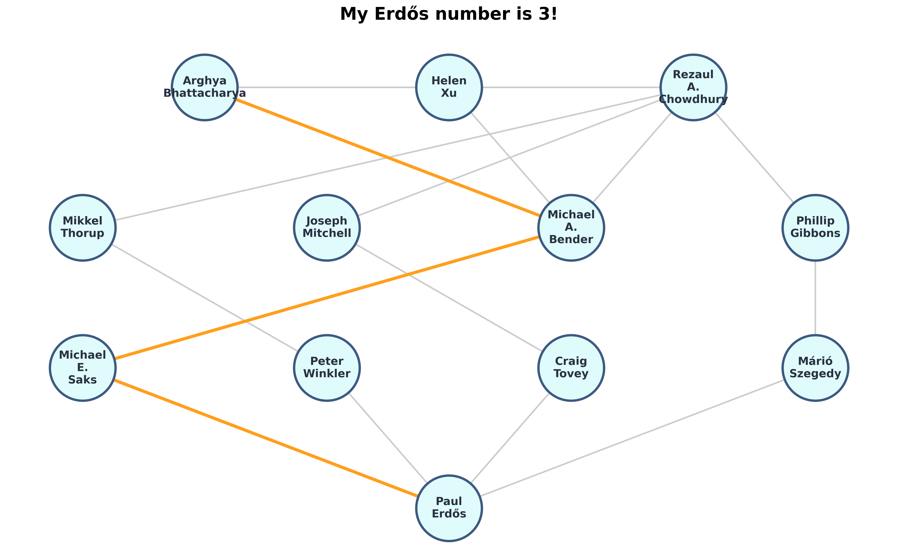

# My Erdős Number is 3!

> **Author:** Arghya Bhattacharya
> **Date:** September, 2025

If you're familiar with pop culture, you've probably heard of the "Six Degrees of Kevin Bacon"—the idea that any actor can be linked to Kevin Bacon through their film roles in six steps or fewer. But did you know that the academic and scientific communities have their own, much older version of this?

It’s called the **Erdős number**, and it’s one of the coolest flexes in the mathematical and scientific world.

## Who was Paul Erdős?

For an applied mathematician or engineer, asking who was Paul Erdős is kind of preaching to the choir. Erdős was a brilliant, eccentric, and incredibly prolific Hungarian mathematician of the 20th century. Over his lifetime, he published over 1,500 mathematical papers with more than 500 different collaborators. Because he worked with so many different people across so many different fields, the mathematical community created a fun way to measure their "collaborative distance" to him.

### Some Mathematical Contributions of Erdős

Paul Erdős fundamentally reshaped modern mathematics through his prolific output. Some of his contributions spanning combinatorics, analytic number theory, and probabilistic number theory are as follows.

* **(1) The Probabilistic Method:** He pioneered the technique of proving the existence of combinatorial structures by showing that a random construction satisfies the desired properties with a strictly positive probability, famously applying it to establish the lower bound $R(k,k) > 2^{k/2}$ for Ramsey numbers.
* **(2) The Elementary Proof of the Prime Number Theorem:** Alongside Atle Selberg, he provided the first proof of the asymptotic distribution of primes, $\pi(x) \sim \frac{x}{\ln x}$, relying solely on real-variable techniques and Selberg's symmetry formula without invoking the complex-analytic properties of the Riemann zeta function $\zeta(s)$.
* **(3) The Erdős–Kac Theorem:** A foundational result establishing that the number of distinct prime factors of an integer $n$, denoted $\omega(n)$, follows a standard normal distribution. Specifically, he proved that the natural density of integers $n \le x$ for which $\frac{\omega(n) - \log \log n}{\sqrt{\log \log n}} \le z$ converges to $\frac{1}{\sqrt{2\pi}} \int_{-\infty}^{z} e^{-t^2/2} dt$ as $x \to \infty$.

## Finding My Erdős Number

I am incredibly fortunate to have worked alongside some truly brilliant minds who connected me to this legacy. Thanks to my collaborations with amazing researchers like Helen Xu, Rezaul Chowdhury, and my doctoral advisor, Michael Bender, **my Erdős number is 3!** That means I am only three collaborative steps away from one of the greatest mathematical minds in history. Whoa!

You can check out the exact chain of co-authorships that gets me to Paul Erdős on [MathSciNet here](https://mathscinet.ams.org/mathscinet/freetools/collab-dist?source=1525986&target=189017).)*

The easiest way to calculate your collaborative distance to Paul Erdős (or anyone else) is by using the American Mathematical Society's **MathSciNet**. They have a free "Collaboration Distance" tool.

.

## How does the Erdős Number work?

An Erdős number is assigned based on co-authorship of published academic papers:
* **Paul Erdős** has an Erdős number of **0**.
* Anyone who co-authored a paper directly with Erdős has an Erdős number of **1** (there are 511 of these fortunate folks).
* Anyone who co-authored a paper with someone who has an Erdős number of 1 has an Erdős number of **2**.
* ...and so on.

**The Shortest Path Rule:** In the language of graph theory, the academic community forms a massive undirected graph where authors are "nodes" and joint papers are "edges." Because researchers collaborate widely, it is very common to have multiple paths back to Paul Erdős. In these cases, your Erdős number is strictly defined as the **shortest path** (the minimal number of hops) between you and Erdős. For example, if you co-author a paper with someone who has an Erdős number of 4, but you also have written a paper with someone who has an Erdős number of 2, your Erdős number is 3. You always inherit the lowest possible score plus one!

.

If you have no collaborative link to Erdős at all, your number is undefined (or infinite).

## Why is it so cool?

The Erdős number is a brilliant real-world example of a "small-world network." It perfectly illustrates the interconnectedness of human knowledge and scientific discovery. Even if you work in biology, computer science, or linguistics, there is a very good chance you are connected to Paul Erdős through a chain of interdisciplinary papers.

It’s far more than just a quirky piece of trivia; having a low Erdős number is a coveted badge of honor in academia. It serves as a permanent, verifiable testament to your place within the grand lineage of mathematical history. It reminds us that science isn't just about solitary geniuses working in dark rooms; it’s a massive, continuously growing web of global collaboration—and having a low number means you are deeply woven into that fabric.

---